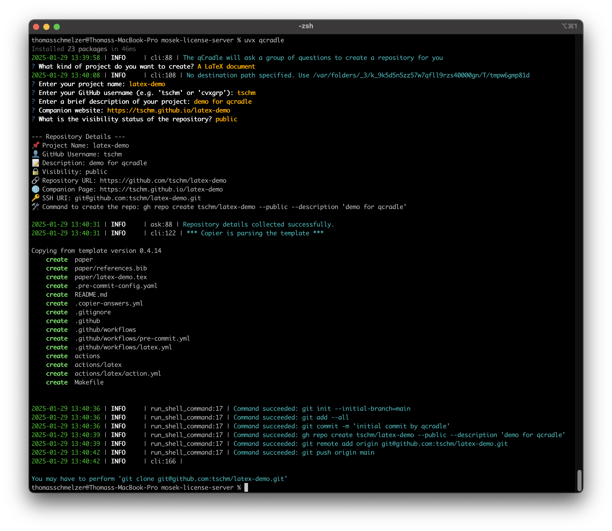

# cvxcradle

[](https://github.com/cvxgrp/cradle/blob/master/LICENSE)
[](https://coveralls.io/github/cvxgrp/cradle?branch=main)
[](https://github.com/cvxgrp/cradle/actions/workflows/ci.yml)

cradle is a command line tool to create repos based on a group of templates.



## Install gradle

We currently assume the reader is doing a clone of this repo via

```bash
git clone git@github.com:cvxgrp/cradle.git
```

### Install gh

Please install GitHub's official command line tool [gh](https://github.com/cli/cli).
This tool is used to create GitHub repos from the command line.

### Verify a working SSH GitHub connection

Try with

```bash
make verify
```

A new SSH connection could be established [here](https://docs.github.com/en/authentication/connecting-to-github-with-ssh/generating-a-new-ssh-key-and-adding-it-to-the-ssh-agent).

## Using the cradle tool

Cradle is a command-line utility that creates projects from templates.
It is similar to the popular
[Cookiecutter](https://cookiecutter.readthedocs.io/en/stable/#) project.

### Help

We essentially expose the copier interface directly with
minor modifications, e.g. if the user is not submitting a source template
we offer to choose one of the standard templates.

The command line interface supports additional flags, e.g. **kwargs arguments
for the function exposed. Hence in the standard

```bash
uv run cradle --help
```

help would be interpreted as an argument for the cradle function. We recommend
using via

```bash
uv run cradle -- --help
```

indicating that help is an argument for the actual command line application.
It will result in

```bash
NAME
    cradle - The CRADLE interface. Create GitHub repositories from the command line. It is also possible to create a large number of GitHub repositories.

SYNOPSIS
    cradle <flags>

DESCRIPTION
    The CRADLE interface. Create GitHub repositories from the command line. It is also possible to create a large number of GitHub repositories.

FLAGS
    -t, --template=TEMPLATE
        Type: Optional[str]
        Default: None
        optional (str) template. Use a git URI, e.g. 'git@...'. Offers a group of standard templates to choose from if not specified.
    -d, --dst_path=DST_PATH
        Type: Optional[str]
        Default: None
        optional (str) destination path. Useful when updating existing projects.
    -v, --vcs_ref=VCS_REF
        Type: Optional[str | None]
        Default: None
        optional (str) revision number to checkout a particular Git ref before generating the project.
    Additional flags are accepted.
```

### Templates

You could create your own templates and standardize project structures
across your team or organization.
It's essentially a project scaffolding tool that helps maintain consistency
in Python projects.

We currently offer $3$ templates out of the box

- The document template
- The experiments template
- The package template

#### Standard Templates

We follow the one template, one repository policy.
You are encouraged to create your own templates and we give $3$ examples that
may serve as inspiration

##### [The document template](https://github.com/tschm/paper)

The template supports the fast creation of repositories of LaTeX documents.
Out of the box you get

- curated pre-commit-hooks (e.g. for spelling)
- github ci/cd workflows
- Makefile
- Example *.tex and bib file.

##### [The experiments template](https://github.com/tschm/experiments)

Here we support the creation of notebooks without the ambition to release software.
The repo is not minimalistic but comes with a curated set of pre-commit hooks and
follows modern and established guidelines.

- uv support
- curated pre-commit-hooks
- DevContainer
- github ci/cd workflows
- Makefile
- marimo support

##### [The package template](https://github.com/tschm/package)

The package template is most useful when the final
goal is the release of software to a registry, e.g. pypi.
It features include

- uv support
- curated set of pre-commit hooks
- DevContainer
- Makefile
- github ci/cd workflows
- marimo support
- JupyterBook
- pdoc documentation

#### Proprietary templates

##### Creation

You can create your very own templates and we recommend to start with
forking the
[dedicated repo](https://github.com/tschm/template/blob/main/README.md).
Templates rely on [Jinja](https://jinja.palletsprojects.com/en/stable/).
At the root level the repo needs a 'copier.yml' file and a 'template' folder.

Each template is tested using [act](https://github.com/nektos/act), e.g.
we render the project template and test the workflows of the created project.
This helps to avoid creating projects starting their life in a broken state.

##### Usage

We essentially expose the copier interface directly with
minor modification, e.g. if the user is not submitting a source template
we offer to choose one of the standard templates.

The command line interface supports additional flags, e.g. **kwargs arguments
for the function exposed. Hence in the standard

```bash
uv run cradle --template=git@github.com:tschm/paper.git
```

If the parameter vcs_ref is not specified this will use the most recent released tag
By default, Copier will copy from the last release found in 
template Git tags, sorted as [PEP 440](https://peps.python.org/pep-0440/).

## :warning: Private repositories

Using workflows in private repos will eat into your monthly GitHub bill.
You may want to restrict the workflow to operate only when merging on the main branch
while operating on a different branch or deactivate the flow.
